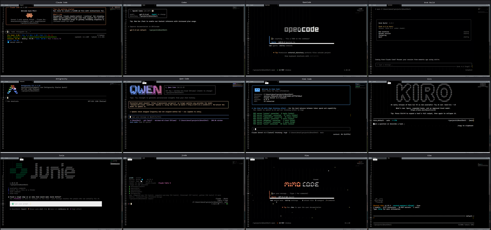

# GhostShell

A bare-bones, owned terminal for Sublime Text — no Terminus dependency. Pure
ctypes against the Windows ConPTY (Pseudoconsole) API, plus a cursor-aware
ANSI renderer (backed by libghostty-vt) tailored to the subset TUI agents
(Claude Code, OpenCode, Codex, etc.) emit.



Which CLIs/agents run in a given tab is a matter of your own profiles in
`ai_terminal.sublime-settings`. Mouse tracking, alt-screen handling, and
page-key routing are per-profile knobs, set by trial and error against
whatever a given TUI actually does — not vetted or "tuned" support, and not
something this README tracks. Planned: a shared TUI-profile layer that
individual agent profiles select from, instead of each one repeating its
own knob values.

## Layout

```
ai_terminal.py          -- Sublime adapter: ConPTY, view I/O, commands, color-scheme
terminal/                -- pure core, unit-testable without Sublime
    screen.py, parser.py, colors.py, keys.py, render.py, caret.py, mouse.py
    ghostty_engine.py, ghostty_vt.py -- ctypes bindings to libghostty-vt (auto-downloads
        the DLL on first load, see below)
    launcher.py, profile_availability.py, profile_schema.py, pty_env.py -- profile/launch
        plumbing
    agent_catalog.py       -- known-CLI catalog backing "Sync Detected Agent Profiles"
    history_scan.py, usage_scan.py   -- scrollback/usage helpers
    session_text_log.py, log_paths.py -- plain-text session transcript logging
    layout.py, cast_recorder.py, color_scheme_log.py, raw_debug_log.py,
        settings_debug_log.py -- resize/recording/diagnostic support
    bin/ghostty-vt.dll  -- libghostty-vt (not tracked in Git, downloaded automatically)
Default.sublime-keymap, Default.sublime-mousemap -- key/mouse-forwarding bindings, gated
    by setting.ai_terminal_view
Main.sublime-menu       -- Tools > Ai Terminal submenu
Default.sublime-commands, Context.sublime-menu, Side Bar.sublime-menu,
Tab Context.sublime-menu -- command palette / context-menu entries
ai_terminal.sublime-settings     -- profiles (shells/agents), rendering knobs
ai_terminal.sublime-color-scheme -- color scheme with the ai.terminal.* scopes
tools/                  -- agent_broker.py + agent_broker_client.py (detachable-session
    broker, see docs/DETACHABLE_SESSIONS.md), scan_agents.py, check_import.py (import
    sanity check), recovery/diagnostic scripts
tests/                  -- unit tests for terminal/*, no Sublime required
```

See [COMMANDS.md](COMMANDS.md) for every registered command: ST command name,
command palette entry, menu location(s), and keybinding.

`Ai Terminal: Sync Detected Agent Profiles` is an optional bootstrap command.
It checks the current PATH for CLIs known to `terminal/agent_catalog.py` and
rewrites only the machine-generated `ai_terminal_agents.sublime-settings`.
It never edits `ai_terminal.sublime-settings`; a hand-written profile with the
same display name always overrides the generated one. Syncing is useful after
installing a new agent, but is unnecessary for profiles already maintained in
the main settings file.

See [docs/DETACHABLE_SESSIONS.md](docs/DETACHABLE_SESSIONS.md) for the
windowless broker architecture, recovery commands, guarantees, limitations,
and live detach/reconnect soak tests.

## Installing

Symlink this repo into your Sublime Text `Packages/` directory:

```powershell
New-Item -ItemType SymbolicLink -Path "$env:APPDATA\Sublime Text\Packages\GhostShell" -Target "<path to this repo checkout>"
```

The symlinked folder can be named anything -- ai_terminal.py has no hardcoded
package-name import, so nothing needs updating to match.

### Getting libghostty-vt.dll

The DLL isn't tracked in Git (it's a built binary artifact). Nothing to do
by hand: the first time `ai_terminal.py` loads, `terminal/ghostty_vt.py`
downloads the pinned binary from a GitHub Release, verifies it against a
recorded SHA-256, and places it at `terminal/bin/ghostty-vt.dll` — a file
already there that already matches the checksum is reused as-is, no network
touched. Set the `GHOSTTY_VT_DLL` env var (or pass a path to
`load_library()`) to point at a different build during development instead.

To build it yourself: clone https://github.com/ghostty-org/ghostty, run
`zig build`, and copy `zig-out/bin/ghostty-vt.dll` to the path above.

The fingerprint and source revision of the currently pinned binary are in
[terminal/GHOSTTY_VT_PROVENANCE.md](terminal/GHOSTTY_VT_PROVENANCE.md); its
reported libghostty-vt version is `0.1.0-dev`.

## Testing

```
python -m pytest tests/ -q
```

`python -m unittest discover -s tests -v` also works but silently misses
the pytest-only tests in this suite (fewer collected than the command
above) — use the pytest invocation for a full run.
